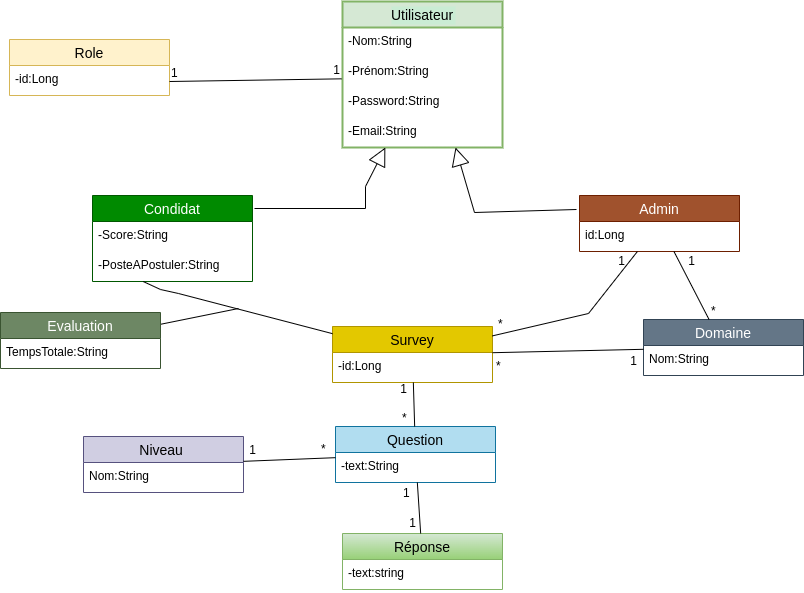

# Gestion d'entretien

## un site web est développer en Spring Boot pour aider les candidats à bien s’entrainer sur des entretiens techniques à l’aide des questions pertinentes selon la technologie ou bien le poste demandé.

### Diagram

## Technology
    +Java 11/8
    +Spring Boot 2.7(Spring Data JPA,Spring Web ,Lombok ,Spring DevTools)
    +MySQL(MySQL Driver)

### Dans  cette partie ,on a :
    *Creer un nouveau projet Spring
    *Configurer le projet
    *creer les entities(User,Domain,Evalution,Niveau,Question,Response,Role,Survey,Domain).
### Liens utiles :
    -Spring initializr:  https://start.spring.io